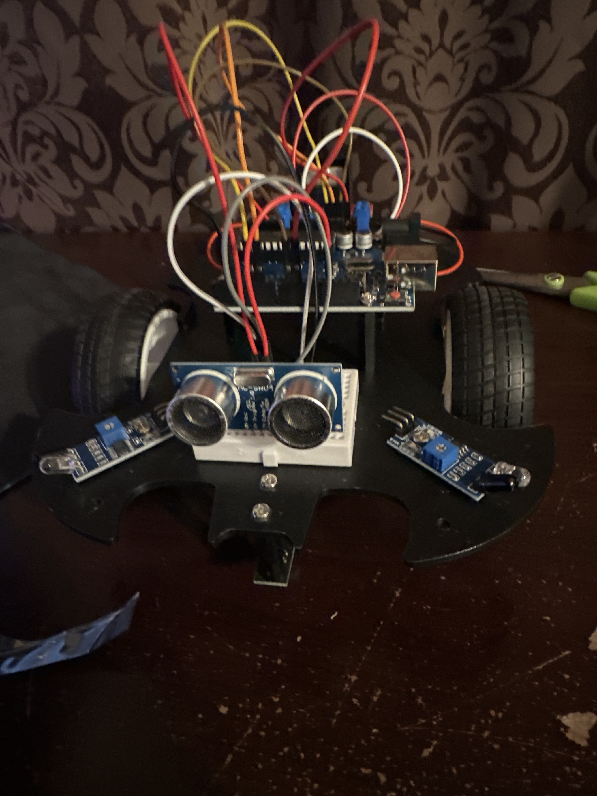

# Smart Car
In this project, I used an arduino, breadbord, and sensors to create a robotic car that has multiple capablities. From following a line on the ground to avoiding obstacles, this smart car can do it all!

| **Engineer** | **School** | **Area of Interest** | **Grade** |
|:--:|:--:|:--:|:--:|
|Utkarsh G | UMD | Computer Science | Junior

  
# Project Recap
After exploring thoroughly with this kit there is a lot to be said. The number of parts given in the SunFounder kit is astounding and leaves a lot to be explored/discovered. I myself tried out all their tutorials but also ended up mixing and matching them to create my own fun little side projects and I want to talk about them here.

## Issues I faced
Before I talk about all the fun to be had, I do want to talk about some of risks/challenges I faced when building my car. Primary, the parts are very small. While the electronic portions are easy to deal with, when assembling the car using the screws and nuts, extra attention is required. I myself dropped the nuts and screws multiple times and had to scramble around on the floor looking for them. Another challenge is the chassis. While it may look symmetrical, it is not. If components are placed in the wrong spot, fixing the issue is quite the head ache. Finally, the battery on board may not be powerful enough to fully power the car. Thus, placing the wires strategically and controlling the flowing of electricity intelligently is important. 

## Modifications using the kits we have
Some mods I did: 
  - Using a combination of the line following module and the obstacle avoidance module, I was able to make a race track and allow the car to run on its own. Avoiding the walls and obstacles while trying to follow the line.
  - Using the red and green LEDs allowed me to make a fun red light/green light game with the car (of course the car won every time) but it showed me the capabilities that are possible within this kit. 
  - The photoresistor helped me make a car that was afraid of the dark and would constantly try to escape any dark room it was put in. 

## Extra modifications that we could do with more parts
Some potential mods: 
  - A GPS module would allow for the creation of a small scale atomic/self-driving car
  - Voice recognition module would allow me to give the car commands to follow instead of relying on a controller
  - A larger chassis and a robotic arm could make a fun gadget that could be used to pick up items and move them

| Part  | Description | Price | Link | 
| :-: | :-: | :-: | :-: | 
| part a  | does thing b  | $10 | <a href="www.something.com"> Something </a> | | part b  | does thing c  | $10 | <a href="www.something.com"> Something </a> | 
