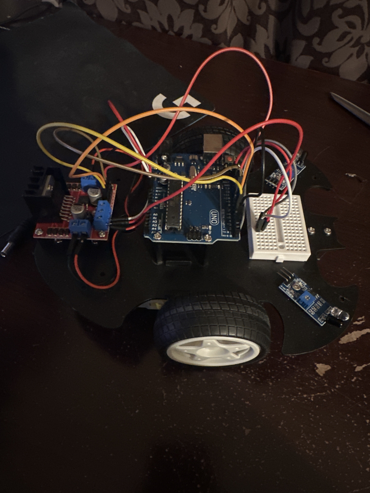

# Smart Car
In this project, I used an arduino, breadbord, and sensors to create a robotic car that has multiple capablities. From following a line on the ground to avoiding obstacles, this smart car can do it all!

| **Engineer** | **School** | **Area of Interest** | **Grade** |
|:--:|:--:|:--:|:--:|
|Utkarsh G | UMD | Computer Science | Junior

  
# Project Recap
After exploring thoroughly with this kit there is a lot to be said. The amount of parts given in the SunFounder kit is astounding and leaves a lot to be explored/discovered. I myself tried out all their tutorials but also ended up mixind and matching them to create my own fun little side projects and I want to talk about them here.

Before I talk about all the fun to be had, I do want to talk about some of risks/challenges I faced when building my car. Primarly, the parts are very small. While the electronic portions are easy to deal with, when assembling the car using the screws and nuts, extra attention is required. I myself dropped the nuts and screws multiple times and had to scramble around on the floor looking for them. Another challenge is the chassis. While it may look symmetrical, it is not. If components are placed in the wrong spot, fixing the issue is quite the head ache. Finall, the battery on board may not be powerful enough to fully power the car. Thus, placing the wires strategically and controlling the flowing of electricity intelligently is important. 

